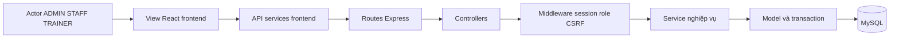
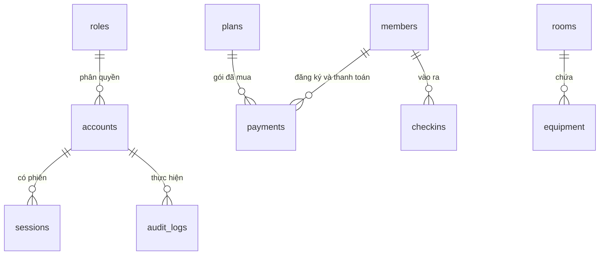

# Sơ đồ kiến trúc và dữ liệu

Huấn luyện viên được quản lý ở trainers; hồ sơ này độc lập với accounts. login_attempts lưu giới hạn đăng nhập. mutation_lock bảo vệ transaction ghi. Các kiểu cột, CHECK và index chuẩn nằm trong backend/sql/01_schema.sql.
