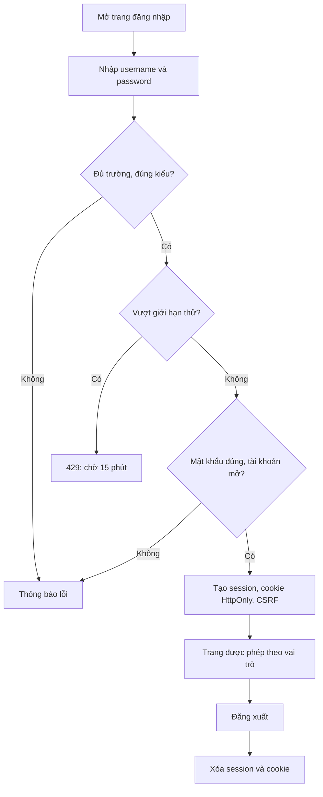
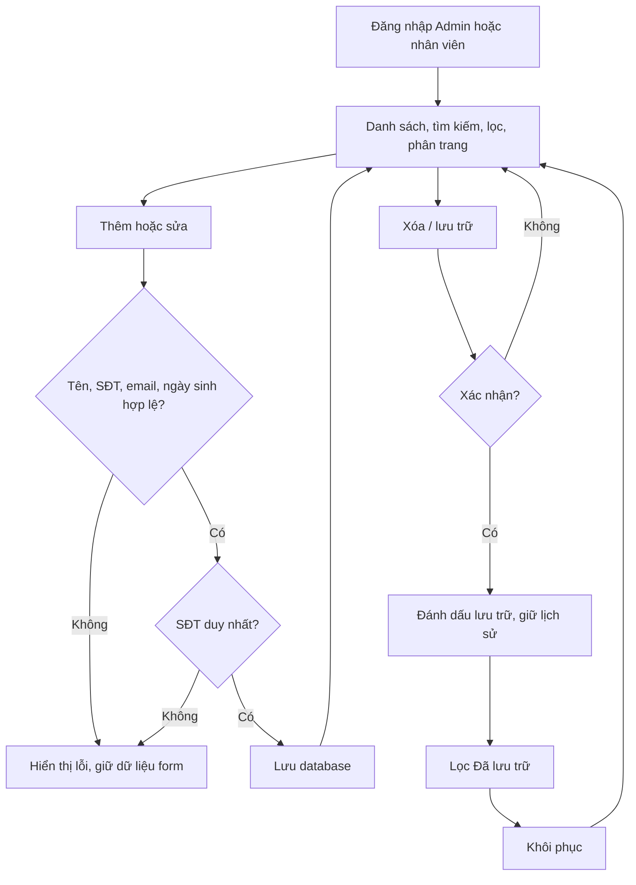
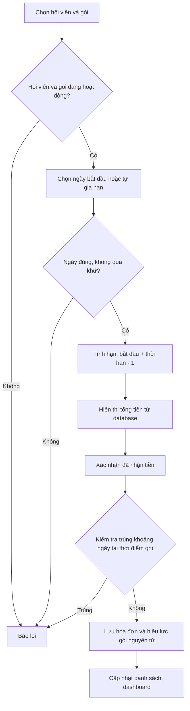
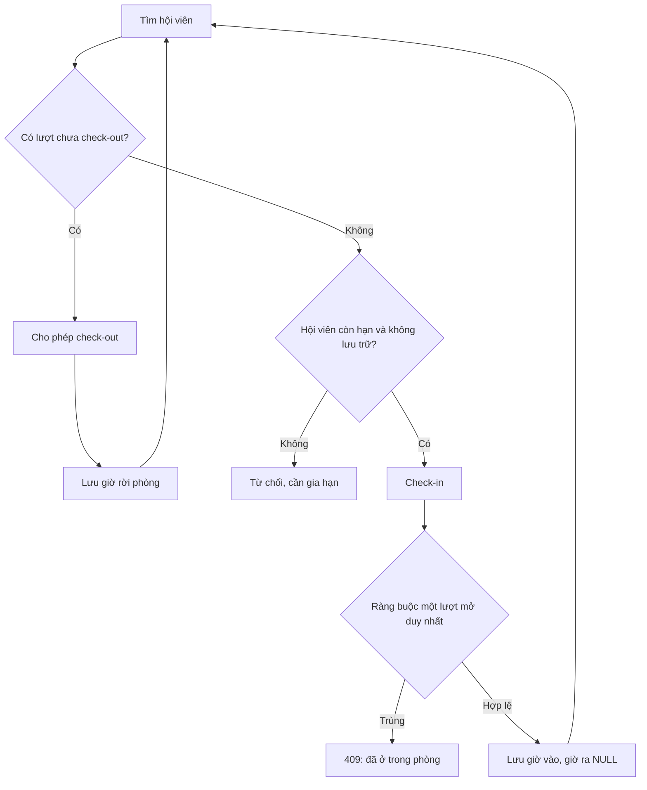
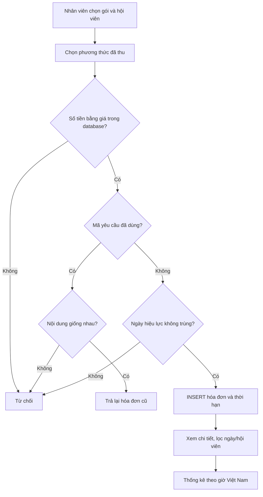
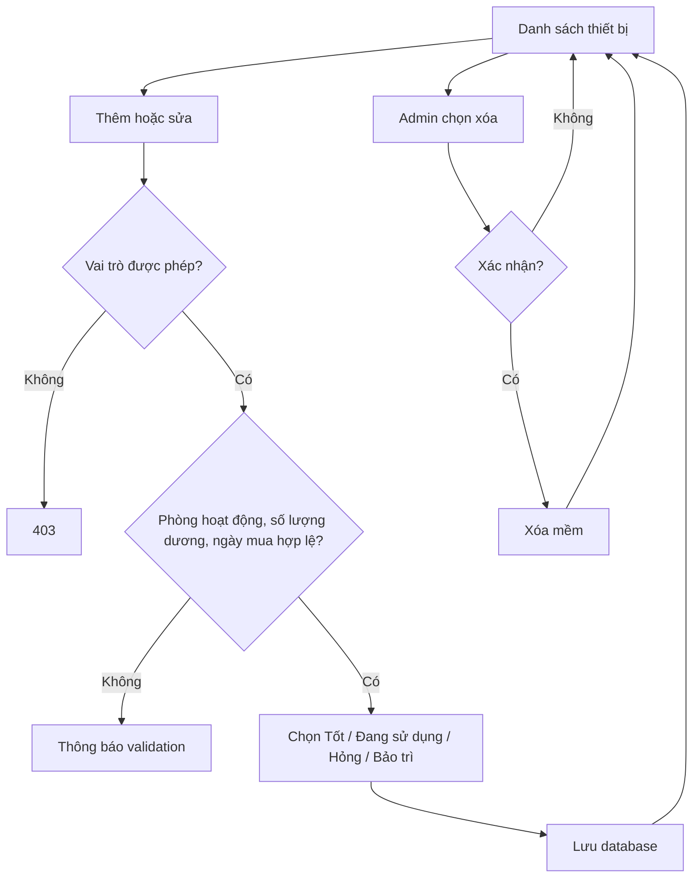
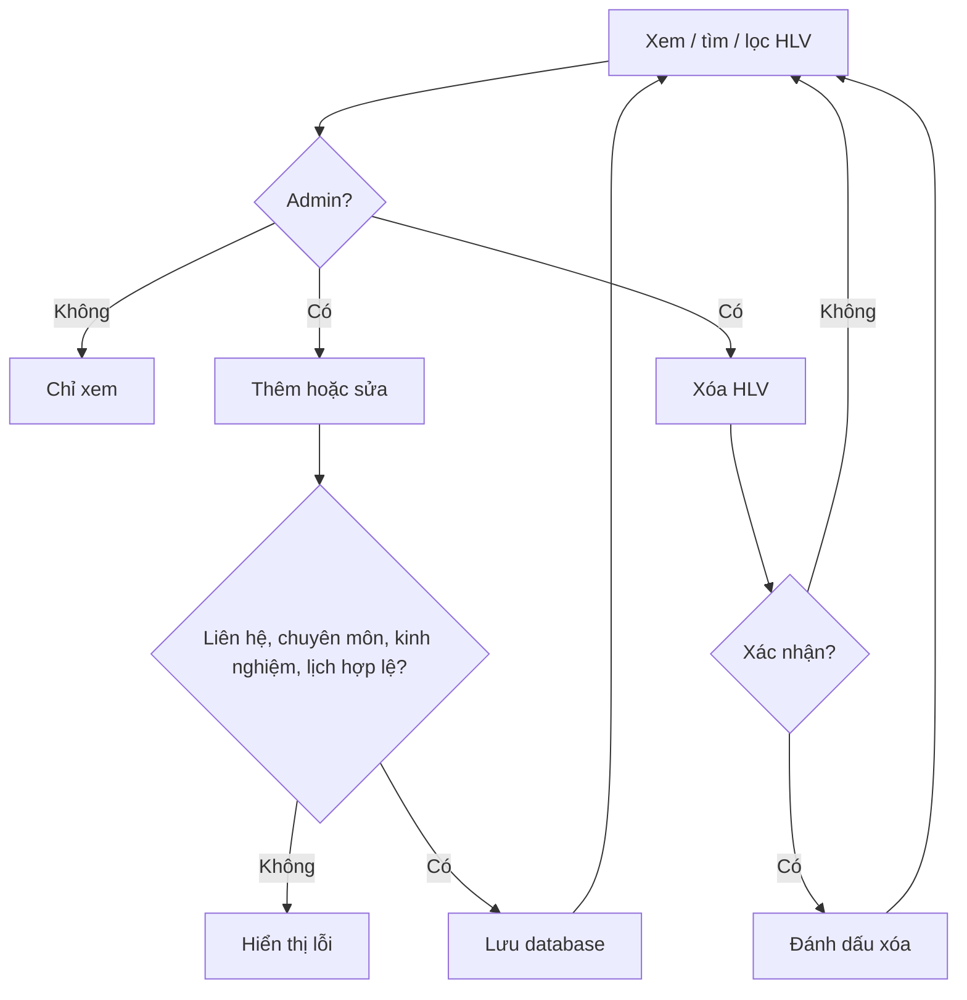

# Luồng nghiệp vụ kiểm thử

Các khối Mermaid có thể dán vào Mermaid Live Editor hoặc tính năng chèn Mermaid của draw.io.

## 1. Đăng nhập

## 2. Quản lý hội viên

## 3. Đăng ký gói tập

## 4. Check-in/out

## 5. Thanh toán

## 6. Quản lý thiết bị

## 7. Quản lý HLV

